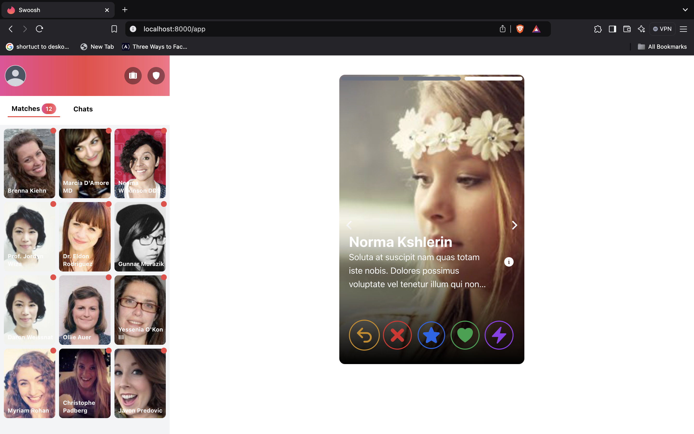
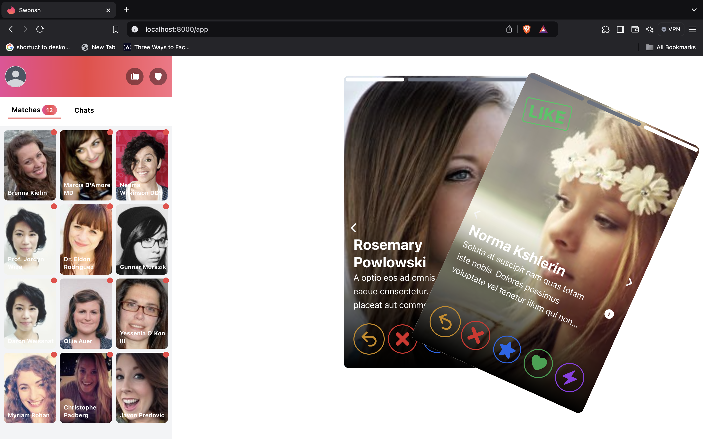
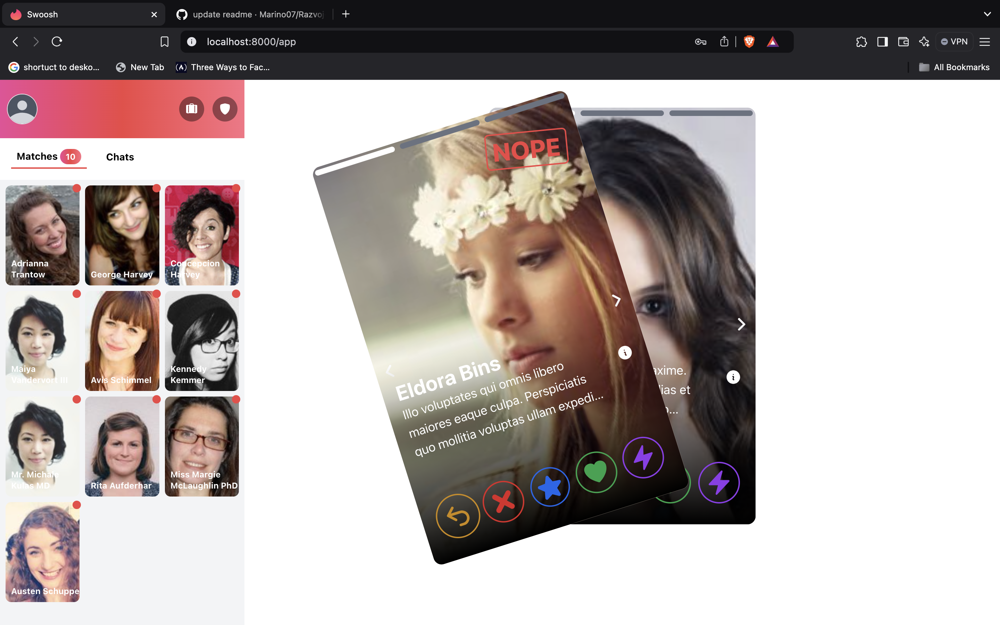
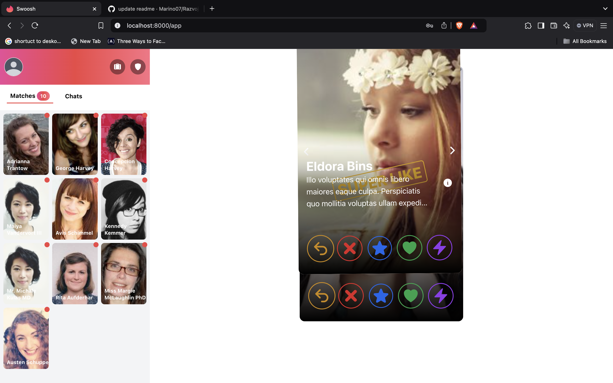
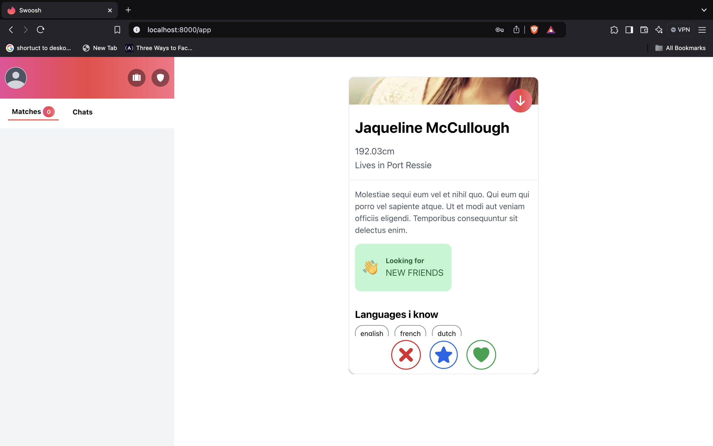
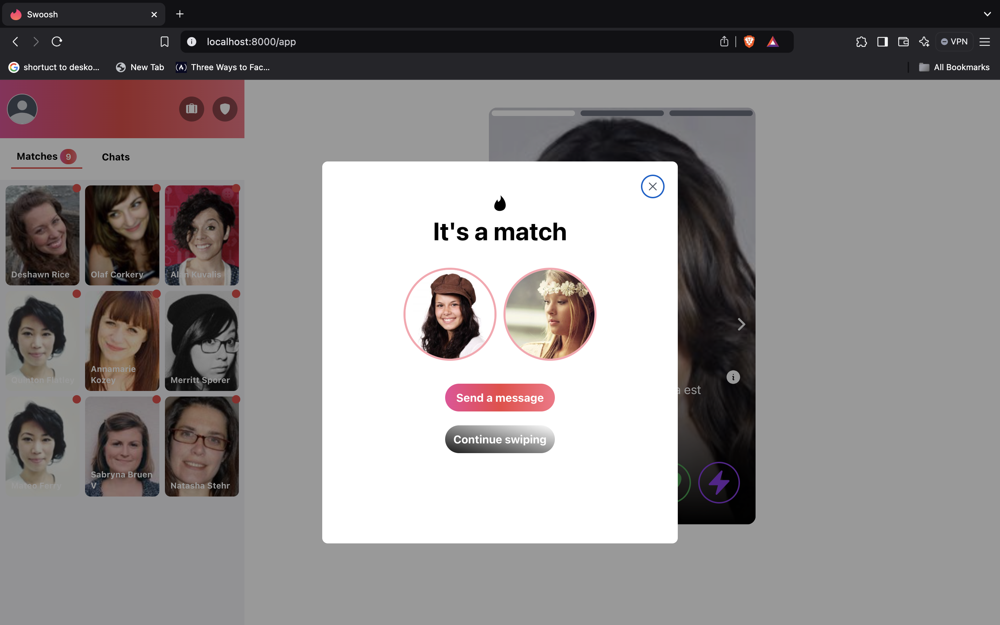
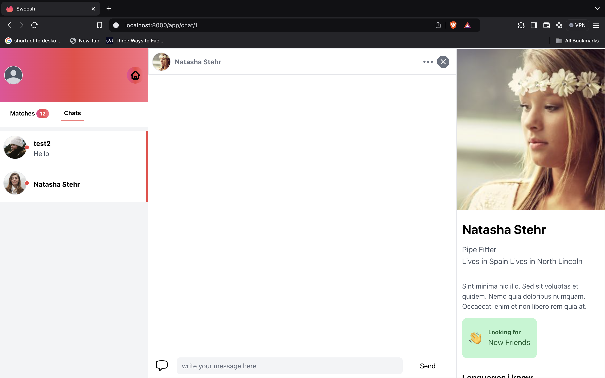
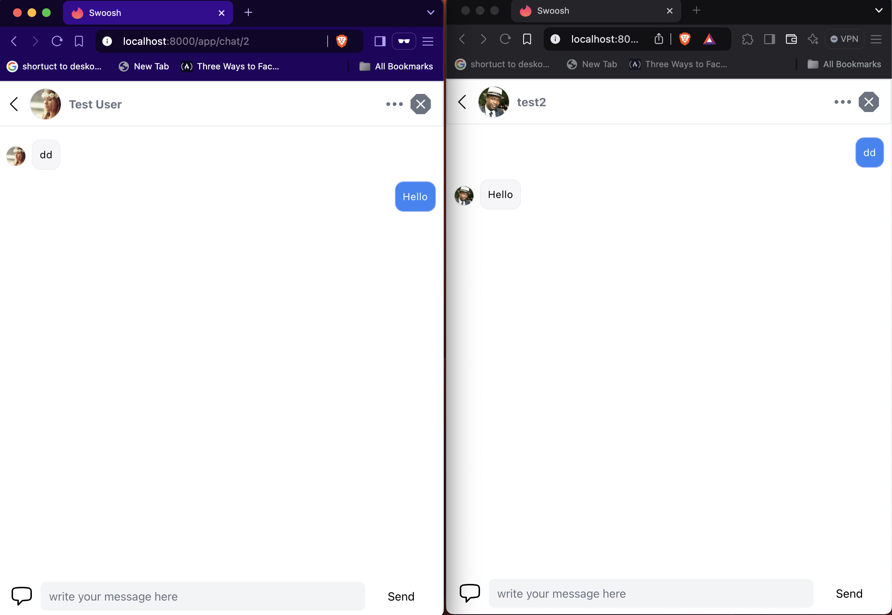

## Swoosh

This application is a dating platform that allows users to connect and communicate through a "swipe" system. Users can browse profiles, swipe left, right, or up, and when a "match" is created, they can start a conversation. **While this application is not fully completed, it provides valuable practical experience in web development and the implementation of real-time features.**

### Key Features

- **Swipe System**
- **Matchmaking**
- **Conversations**: Utilizes **Broadcasting** for real-time notifications of new messages.

### Technologies

- **Backend**: Laravel PHP framework
- **Frontend**: Blade, Livewire, AlpineJs, Tailwind, HammerJs
- **Database**: MySQL
- **Authentication**: Laravel Sanctum
- **Broadcasting**: Pusher or Laravel Echo for real-time communication.

### Short Preview of the Application

#### Welcome Page

#### App

### RIGHT
 USERS CAN SWIPE ON MOVE OR ON BUTTON BELOW IMAGE 

### LEFT
 SAME AS SWIPING RIGHT WE DO LEFT

### SWIPING UP for superlike

### Personal information

### Personal information
#### When two users swipe to right then there is a match

### Basic chat

### Broadcasting messages

#### We achived broadcasting with Pusher -- on client Laravel Echo 

To testing broadcasting we need two browsers and two users who are in same conversation

This is a brief preview of the application. Throughout the development process, I learned how to implement **Broadcasting** for real-time notifications, enhancing user interaction and engagement. Additionally, I gained valuable experience in using various technologies such as Laravel, Livewire,AlpineJS Tailwind CSS, which significantly improved my skills in building dynamic web applications. This project has been a great opportunity to apply my knowledge and explore new concepts in web development.

